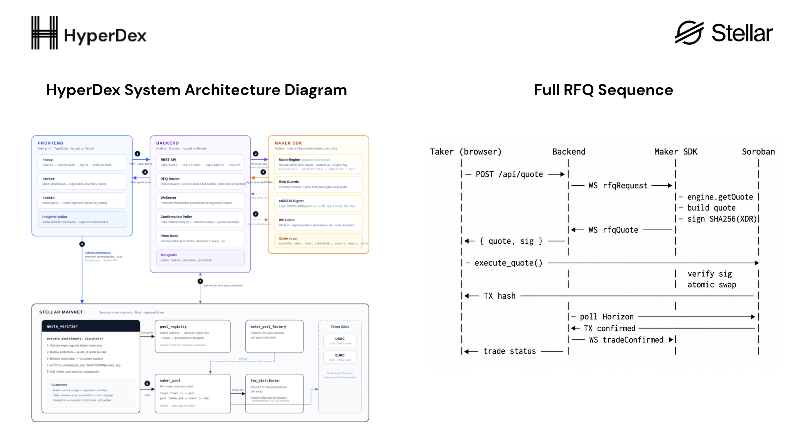

<div align="center">


# HyperDEX

### Sealed-Bid RFQ DEX on Stellar Soroban — USDC ↔ EURC with No AMM, No Slippage.

**Taker requests quote → Maker signs off-chain → Soroban verifies ed25519 and settles atomically**

[Live App](https://hyperdex.live) · [Backend API](https://hyperdex.onrender.com/health) · [Explorer](https://stellar.expert/explorer/public) · [Contracts](#-deployed-contracts) · [Architecture Spec](docs/TECHNICAL_ARCHITECTURE.md) · [Quick Start](#-quick-start)

</div>

---

## Table of Contents

- [Overview](#-overview)
- [Why HyperDEX](#-why-hyperdex)
- [How It Works](#-how-it-works)
- [Architecture](#-architecture) — full spec: [`docs/TECHNICAL_ARCHITECTURE.md`](docs/TECHNICAL_ARCHITECTURE.md)
- [Smart Contracts](#-smart-contracts)
- [Project Structure](#-project-structure)
- [Networks & Wallets](#-networks--wallets)
- [Deployed Contracts](#-deployed-contracts)
- [Backend & WebSocket Server](#-backend--websocket-server)
- [API Reference](#-api-reference)
- [Maker SDK](#-maker-sdk)
- [Frontend](#-frontend)
- [Quick Start](#-quick-start)
- [Testing](#-testing)
- [Security Notes](#-security-notes)
- [Tech Stack](#-tech-stack)

---

## 📌 Overview

HyperDEX is a **production-grade sealed-bid RFQ (Request-for-Quote) DEX** built on Stellar Soroban. It enables gasless, zero-slippage USDC ↔ EURC swaps by separating price discovery (off-chain, by market makers) from settlement (on-chain, by Soroban contracts).

HyperDEX introduces the first RFQ architecture on Stellar:

1. A **taker** requests a swap quote from the backend
2. The backend dispatches an **RFQ** to connected market makers over WebSocket
3. The best-priced **maker** signs the quote with an ed25519 hot key
4. The backend returns the signed quote to the taker
5. The taker submits the quote to Soroban — the **`quote_verifier`** contract verifies the signature and atomically settles the swap

**Price is never discovered on-chain. Only verified and settled.**

---

## 🧩 Why HyperDEX

### The Problem with AMMs on Stellar

Existing Stellar DEXes use AMMs (Automated Market Makers) with on-chain bonding curves. These have fundamental limitations:

```
AMM Model
├── Price determined by reserve ratio (x·y = k)
├── Every large trade moves the price (price impact)
├── Sandwich attacks: bots front-run large swaps
├── Slippage: actual received amount < quoted amount
└── Capital efficiency: 99% of LP capital unused at any price
```

For stablecoin pairs like USDC ↔ EURC (which should trade at ~1:1), AMM slippage is a solved problem in TradFi — market makers quote tight spreads against real FX rates. HyperDEX brings this model on-chain.

### HyperDEX Solves This With a Sealed-Bid RFQ Model

```
RFQ Model (HyperDEX)
├── Price quoted off-chain by professional market makers
├── Quote is cryptographically signed (ed25519) — maker committed, no reneging
├── Quote is sealed: no front-running (bots cannot see it before settlement)
├── Zero slippage: taker receives the exact quoted amount_out
└── Capital efficiency: maker allocates inventory per-quote, not per-pool
```

### Why This Matters for Stellar's DeFi Ecosystem

| Without HyperDEX | With HyperDEX |
|---|---|
| AMM slippage on every USDC↔EURC swap | Zero slippage — guaranteed amount out |
| Front-running by MEV bots | Sealed-bid: quote invisible until settled |
| Fixed on-chain spread (curve-driven) | Competitive market maker spreads |
| LP capital 99% idle in price range | Maker deploys exactly the capital needed |
| No professional liquidity providers | Permissioned maker registration with reputation |

---

## ⚙️ How It Works

### 1. Quote Request & RFQ Dispatch

```
Taker enters: 20 EURC → USDC
        │
        ▼
POST /api/quote { tokenIn, tokenOut, amountIn, takerAddress }
        │
        ▼
Backend RFQ Router
        ├── Rank connected makers by their posted price levels
        ├── Dispatch RFQ to each via WebSocket (30s sealed-bid window)
        └── Collect sealed bids, return best quote (highest amountOut)
```

### 2. Maker Pricing & Signing

```
Maker SDK receives RFQ
        │
        ▼
MakerEngine.getQuote(ctx)   ← pluggable pricing brain
        ├── Default engine: quote the maker's ghost price, fee-adjusted,
        │                   gated by an inventory check + drift guard
        ├── Custom engine:  any logic (live CEX feed, model, fixed rate…)
        ├── Build Quote struct { quoteId, maker, taker, tokenIn, tokenOut,
        │                         amountIn, amountOut, expiry, salt }
        └── Sign SHA256(XDR(quote)) with ed25519 hot key
        │
        ▼
Return { quote, signature } to backend → backend to taker
```

### 3. On-Chain Settlement (Soroban)

```
Taker calls: quote_verifier.execute_quote(quote, signature)
        │
        ├── Validate: expiry not passed (ledger.timestamp)
        ├── Validate: replay protection (quote_id not used before)
        ├── Validate: taker identity (quote.taker == tx.source)
        ├── Verify: ed25519_verify(maker_signer_key, SHA256(XDR(quote)), sig)
        ├── Execute: maker_pool.execute_swap(quote)
        │     ├── Transfer taker's token_in → pool
        │     └── Transfer pool's token_out → taker (amount_out - protocol_fee)
        └── Route: fee_distributor.collect_fee(token, fee_amount)
```

### 4. Trade Confirmation

```
Backend ConfirmationPoller
        ├── Polls Soroban RPC for TX status every 5s
        ├── Requires a `quote_executed` event from quote_verifier whose
        │   quote_id AND taker match the trade — a successful transaction
        │   alone is NOT accepted as proof of settlement
        ├── Reads the settled amounts from the maker pool's `swap_executed`
        │   event, accepted only from that maker's registered pool
        ├── Records amountOut (net), feeAmount, and amountInUsd
        ├── Pushes confirmation to maker SDK via WebSocket
        └── Maker SDK displays trade confirmation banner
```

> **Trade amounts.** `Trade.amountOut` stores the **net** the taker received;
> `feeAmount` is the protocol fee carved out on-chain. `amountOut + feeAmount`
> reconstructs the gross the maker signed. Records confirmed before this
> behaviour landed store the gross in `amountOut` with `feeAmount: 0`.

### Quote Struct

The maker signs `SHA256(XDR(quote))` with their registered ed25519 hot key. Soroban serializes `#[contracttype]` structs in **alphabetical field order**:

```rust
pub struct Quote {
    pub amount_in:  i128,        // taker sends this (in stroops)
    pub amount_out: i128,        // taker receives this (guaranteed)
    pub expiry:     u64,         // unix timestamp in seconds (+30s from now)
    pub maker:      Address,     // registered maker Stellar address
    pub quote_id:   BytesN<32>,  // SHA256(params) — unique per quote
    pub salt:       BytesN<32>,  // random 32 bytes
    pub taker:      Address,     // specific taker address
    pub token_in:   Address,     // EURC or USDC SAC
    pub token_out:  Address,     // USDC or EURC SAC
}
```

> **Critical:** Field serialization order is **alphabetical** (`amount_in`, `amount_out`, `expiry`, …), not declaration order. Both the maker SDK serializer and the frontend must match this exactly or signature verification fails.

---

## 🏗 Architecture

> 📘 **Full technical specification: [`docs/TECHNICAL_ARCHITECTURE.md`](docs/TECHNICAL_ARCHITECTURE.md)**
>
> Contract-by-contract breakdown with auth tables, protocol sequence diagrams, Soroban storage
> layout and TTL strategy, typed Rust signatures, the event catalogue, a STRIDE threat model, and
> the component trust matrix. The summary below is the orientation; that document is the reference.



### System Architecture Diagram

```
╔═══════════════════════════════════════════════════════════════════╗
║           STELLAR MAINNET  ·  STELLAR TESTNET                     ║
║     (independent deployments of the same five contracts)          ║
║                                                                   ║
║   ┌─────────────────────────────────────────────────────────┐    ║
║   │  Soroban Smart Contracts                                │    ║
║   │                                                         │    ║
║   │  ┌──────────────┐   ┌─────────────────────────────┐   │    ║
║   │  │ pool_registry│   │     quote_verifier           │   │    ║
║   │  │              │   │                              │   │    ║
║   │  │ maker → key  │   │ 1. validate expiry / replay  │   │    ║
║   │  │ signer map   │◄──│ 2. verify ed25519 signature  │   │    ║
║   │  └──────────────┘   │ 3. call maker_pool.swap()    │   │    ║
║   │                     └────────────┬────────────────-─┘   │    ║
║   │                                  │                       │    ║
║   │  ┌──────────────────────────────▼──────────────────┐   │    ║
║   │  │  maker_pool  (per-maker, deployed by factory)   │   │    ║
║   │  │                                                 │   │    ║
║   │  │  token_in (EURC) ──► pool ──► token_out (USDC)  │   │    ║
║   │  │  protocol fee  ──────────────► fee_distributor  │   │    ║
║   │  └─────────────────────────────────────────────────┘   │    ║
║   │                                                         │    ║
║   │  ┌──────────────┐   ┌──────────────────────────────┐  │    ║
║   │  │ maker_pool_  │   │     fee_distributor           │  │    ║
║   │  │ factory      │   │  accumulates 10 bps per swap  │  │    ║
║   │  │ deploys pools│   │  admin withdraws to treasury  │  │    ║
║   │  └──────────────┘   └──────────────────────────────┘  │    ║
║   └─────────────────────────────────────────────────────────┘    ║
╚═══════════════════════════════════════════════════════════════════╝
                              ▲  ▲
                              │  │ Soroban RPC
╔═══════════════════════════════════════════════════════════════════╗
║                     BACKEND (Node.js / Express)                   ║
║        one instance per network — STELLAR_NETWORK env var         ║
║        mainnet: https://hyperdex.onrender.com                     ║
║        testnet: http://localhost:4000                             ║
║                                                                   ║
║   REST API ──── /api/quote ──────────────── RFQ Router            ║
║                 /api/trades                      │                ║
║                 /api/makers                      │ WebSocket      ║
║                 /health                   ┌──────▼────────┐      ║
║                                           │  WsServer     │      ║
║   Confirmation ──── Horizon Poller        │               │      ║
║   Poller             (every 5s)           │  maker conns  │      ║
║                                           └──────┬────────┘      ║
║   MongoDB ──── trades, makers,                   │               ║
║                rate limits,                      │ WS messages   ║
║                price book                        │               ║
╚═══════════════════════════════════════════════════════════════════╝
                                                   │
╔══════════════════════════════════════════════════╪════════════════╗
║              MARKET MAKER SDK (Node.js)                           ║
║              http://localhost:3001                                ║
║                                                                   ║
║   MakerEngine — the pluggable pricing brain:                      ║
║     - default ghost-price engine, or custom via --engine          ║
║                                                                   ║
║   getLevels()   -> resting price levels, streamed every ~3s ─────►║
║   getQuote(ctx) -> signed amountOut per RFQ (null = skip) ───────►║
║                                                                   ║
║   Signer (ed25519) ──► Quote + Sig ──── to taker (via backend)    ║
║                                                                   ║
║   Trade Confirmed ◄─────── TradePushService push                  ║
╚═══════════════════════════════════════════════════════════════════╝
                    ▲
╔═══════════════════╪═══════════════════════════════════════════════╗
║           FRONTEND (Next.js 14)  ·  https://hyperdex.live         ║
║                   │                                               ║
║   /swap  ──── Quote UI ──────── POST /api/quote                   ║
║   /maker ──── Maker Dashboard ─ REST + WebSocket                  ║
║   /admin ──── Admin Panel ───── REST (admin-gated)                ║
║   /docs  ──── Protocol docs                                       ║
║                                                                   ║
║   Wallet:  Stellar Wallets Kit — Freighter · xBull · LOBSTR ·     ║
║            Rabet · Albedo · Hana · HOT Wallet · Ledger            ║
║   Network: runtime switcher (mainnet/testnet) in localStorage;    ║
║            every /api/* call tagged x-hyperdex-network            ║
╚═══════════════════════════════════════════════════════════════════╝
```

### Full RFQ Sequence

```
Taker (browser)          Backend               Maker SDK           Soroban
      │                     │                      │                   │
      │─ POST /api/quote ──►│                      │                   │
      │                     │─── WS rfqRequest ───►│                   │
      │                     │                      │─ engine.getQuote  │
      │                     │                      │─ build quote      │
      │                     │                      │─ sign SHA256(XDR) │
      │                     │◄── WS rfqQuote ──────│                   │
      │◄─ { quote, sig } ───│                      │                   │
      │                     │                      │                   │
      │─ execute_quote() ──────────────────────────────────────────────►
      │                     │                      │  verify sig       │
      │                     │                      │  atomic swap      │
      │◄── TX hash ─────────────────────────────────────────────────── │
      │                     │                      │                   │
      │                     │─ poll Horizon ────────────────────────── │
      │                     │◄─ TX confirmed ──────────────────────────│
      │                     │─── WS tradeConfirmed ►│                  │
      │◄── trade status ────│                      │                   │
```

---

## 📜 Smart Contracts

All contracts are written in **Rust / Soroban SDK** and compiled to WebAssembly. They run on Stellar's Soroban smart contract platform.

### `pool_registry`

The single source of truth for registered market makers. Stores the ed25519 hot signing key that the `quote_verifier` uses to validate quotes.

| Function | Description |
|---|---|
| `register_maker(maker, signer_key)` | Register a maker address with their ed25519 public key |
| `update_signer(maker, new_key)` | Rotate signer key without downtime |
| `set_maker_active(maker, active)` | Pause/unpause a maker (admin or self) |
| `get_maker(maker)` | Returns `{ signer_key, active, registered_at }` |
| `get_all_makers()` | Returns list of all registered makers |

**Security:** Each maker's signing key is stored in persistent Soroban storage with extended TTL. Signer rotation is permissioned — only the maker themselves or admin can rotate.

### `quote_verifier`

The taker-facing entry point. Validates and settles every swap.

**Settlement logic:**
```
execute_quote(quote: Quote, signature: BytesN<64>)
  1. require!( ledger.timestamp() < quote.expiry )          // not expired
  2. require!( !used_quote_ids.contains(quote.quote_id) )  // no replay
  3. require!( quote.taker == env.invoker() )               // correct taker
  4. let signer_key = pool_registry.get_maker(quote.maker).signer_key
  5. ed25519_verify(signer_key, sha256(quote.to_xdr()), signature)  // valid sig
  6. used_quote_ids.insert(quote.quote_id)                  // mark used
  7. maker_pool.execute_swap(quote)                         // atomic settlement
```

| Function | Description |
|---|---|
| `execute_quote(quote, sig)` | Verify + settle a signed quote |
| `set_pool_registry(addr)` | Admin — set the registry contract address |
| `set_fee_distributor(addr)` | Admin — set fee distributor address |
| `set_protocol_fee_bps(bps)` | Admin — set protocol fee in basis points |

### `maker_pool` (per-maker, factory-deployed)

Each registered maker has their own isolated pool contract deployed by the factory. Holds token inventory, executes atomic swaps, and routes protocol fees.

| Function | Description |
|---|---|
| `deposit(token, amount)` | Maker deposits USDC or EURC inventory (2-TX: approve + deposit) |
| `withdraw(token, amount)` | Maker withdraws inventory |
| `execute_swap(quote)` | Called by `quote_verifier` — transfers token_in from taker, token_out to taker |
| `get_balances()` | Returns `{ usdc, eurc }` in stroops |

**Access control:** `execute_swap` requires `require_auth()` from the registered `quote_verifier` address — cannot be called directly.

**Persistent storage TTL:** All storage entries (`Usdc`, `Eurc`, `SignerKey`, `QuoteVerifier`, `Owner`) are extended on every `deposit()` and `withdraw()` call to prevent Soroban persistent-storage ledger expiry (the entry TTL is bumped on each state change).

### `maker_pool_factory`

Deploys new `maker_pool` contracts for registered makers using deterministic addressing.

| Function | Description |
|---|---|
| `deploy_pool(maker, signer_key)` | Deploy a pool for this maker; salt = `sha256(maker.to_xdr())` |
| `get_pool(maker)` | Returns deployed pool address for a maker |

**Deterministic salt:** `salt = sha256(maker.to_xdr())` — ensures the same pool address is computed in both simulation and execution (no ledger-sequence salt which would cause footprint mismatch).

### `fee_distributor`

Accumulates protocol fees (10 bps per swap). Admin withdraws to treasury.

| Function | Description |
|---|---|
| `collect_fee(token, amount)` | Called by `maker_pool` on every swap |
| `withdraw_fees(token)` | Admin withdraws accumulated fees to treasury |
| `get_balance(token)` | Returns accumulated fee balance |

---

## 📁 Project Structure

```
HyperDex/
│
├── contracts/                        # Soroban smart contracts (Rust)
│   ├── pool_registry/                # Maker registration + signer key store
│   │   ├── src/
│   │   │   ├── lib.rs                # Contract entry points
│   │   │   └── types.rs              # MakerInfo, storage keys
│   │   └── Cargo.toml
│   │
│   ├── quote_verifier/               # Taker entry point — verify + settle
│   │   ├── src/
│   │   │   ├── lib.rs
│   │   │   └── types.rs              # Quote struct (alphabetical field order)
│   │   └── Cargo.toml
│   │
│   ├── maker_pool/                   # Per-maker inventory vault + swap executor
│   │   ├── src/
│   │   │   ├── lib.rs
│   │   │   └── types.rs
│   │   └── Cargo.toml
│   │
│   ├── maker_pool_factory/           # Factory — deploys maker_pool contracts
│   │   ├── src/
│   │   │   └── lib.rs
│   │   └── Cargo.toml
│   │
│   └── fee_distributor/              # Protocol fee accumulator
│       ├── src/
│       │   └── lib.rs
│       └── Cargo.toml
│
├── backend/                          # Node.js REST API + WebSocket server
│   ├── src/
│   │   ├── index.ts                  # Express app + WsServer bootstrap
│   │   │
│   │   ├── routes/
│   │   │   ├── quote.ts              # POST /api/quote — RFQ dispatch + auction
│   │   │   ├── makers.ts             # GET/POST /api/makers — CRUD + inventory
│   │   │   ├── trades.ts             # GET /api/trades — trade history + status
│   │   │   ├── health.ts             # GET /health
│   │   │   ├── admin.ts              # GET /api/admin — admin endpoints
│   │   │   └── adminPending.ts       # GET /api/admin/pending — maker approvals
│   │   │
│   │   ├── websocket/
│   │   │   ├── WsServer.ts           # WebSocket server — maker connections
│   │   │   ├── MakerConnection.ts    # Per-maker WS state + ping/pong
│   │   │   ├── TradePushService.ts   # Push trade confirmations to makers
│   │   │   ├── messages/             # WS message type definitions
│   │   │   └── handlers/
│   │   │       ├── onRfqQuote.ts     # Handle maker quote response
│   │   │       └── onError.ts        # Handle maker error / rate limit
│   │   │
│   │   └── utils/
│   │       └── logger.ts             # Winston logger
│   │
│   ├── package.json
│   ├── tsconfig.json
│   └── .env                          # See Environment Variables section
│
├── maker-sdk/                        # Market maker server (TypeScript)
│   ├── src/
│   │   ├── server.ts                 # Bootstrap: loads engine (--engine), WS client, dashboard
│   │   ├── ws-client.ts              # WebSocket to backend; drives engine.getQuote/getLevels
│   │   ├── types/
│   │   │   └── MakerEngine.ts        # ★ MakerEngine interface (getLevels/getQuote/onTradeConfirmed)
│   │   ├── engines/
│   │   │   └── default-engine.ts     # Built-in ghost-price engine (default)
│   │   ├── drift-guard.ts            # Warn >1% / pause quoting >3% vs oracle mid
│   │   ├── ghost-price.ts            # Ghost price state for the default engine
│   │   ├── index.ts                  # Public barrel: export { MakerEngine, ... }
│   │   ├── price-levels.ts           # Builds resting price tiers
│   │   ├── signer.ts                 # ed25519 sign/verify utilities
│   │   ├── serializer.ts             # Quote → XDR ScVal (alphabetical field order)
│   │   ├── oracle.ts                 # FX price feed (CoinGecko + fallbacks), cached
│   │   ├── rate-limiter.ts           # Per-taker RFQ rate limiting
│   │   ├── inventory-checker.ts      # Read pool balances from Soroban
│   │   ├── example-pricer.ts         # Ghost-price decision used by the default engine
│   │   ├── setup.ts                  # Interactive setup wizard
│   │   ├── activate.ts               # Activate maker after pool deployment
│   │   ├── generate-keypair.ts       # Generate ed25519 keypair
│   │   ├── update-signer.ts          # Update signer key on-chain
│   │   └── types.ts                  # Shared type definitions
│   │
│   ├── examples/                     # Custom engine templates for --engine
│   │   ├── fixed-rate-engine.ts      # Simplest engine: hard-coded rate
│   │   └── binance-engine.ts         # Live EUR/USD from Binance WebSocket
│   │
│   ├── credentials/                  # <name>.cred files (git-ignored — secrets)
│   ├── CUSTOM_ENGINE.md              # Guide: building a custom pricing engine
│   ├── TESTING_ENGINES.md            # Guide: E2E-testing engines + common pitfalls
│   ├── package.json
│   └── README.md                     # SDK quick start + engine plugin docs
│
├── frontend/                         # Next.js 14 App Router
│   ├── app/
│   │   ├── page.tsx                  # Landing page
│   │   ├── swap/page.tsx             # Taker swap UI — request quote + execute
│   │   ├── maker/page.tsx            # Maker dashboard — register, deposit, monitor
│   │   ├── admin/page.tsx            # Admin panel — approve maker applications
│   │   └── api/
│   │       └── maker-application/    # Next.js API routes (proxy to backend)
│   │
│   ├── hooks/
│   │   ├── useAuction.ts             # Quote polling + 30s countdown timer
│   │   ├── useIsAdmin.ts             # Check if connected wallet is admin
│   │   ├── useMakerState.ts          # Maker registration status polling
│   │   ├── useWallet.ts              # Wallet connect/disconnect (Wallets Kit)
│   │   └── useNetwork.ts             # Active network, hydration-safe
│   │
│   ├── lib/
│   │   ├── networks.ts               # ★ Dual-network config — mainnet + testnet, runtime-selected
│   │   ├── constants.ts              # Re-exports the ACTIVE network's addresses / URLs
│   │   ├── networkHeader.ts          # Tags /api/* calls with x-hyperdex-network
│   │   ├── server/backendTarget.ts   # Server side: header → backend origin
│   │   └── wallet/kit.ts             # ★ Stellar Wallets Kit — 8 wallets, connect / sign / restore
│   │
│   ├── store/                        # Zustand state stores
│   ├── components/                   # Shared UI components
│   │   └── wallet/                   # WalletSelectModal, NetworkSwitcher, WrongNetworkBanner
│   │
│   ├── .env.local                    # See Environment Variables section
│   └── next.config.js
│
├── scripts/                          # Deployment + utility scripts
│   ├── deploy-v2.sh                  # Deploy all contracts, write addrs to .env
│   ├── smoke-test.ts                 # Full E2E smoke test (npx ts-node)
│   ├── register-maker-mongodb.ts     # Register maker in MongoDB + issue API key
│   ├── reset-test-makers.ts          # Clear orphan makers so /maker restarts clean
│   ├── update-signer.ts              # Rotate a maker's on-chain signer key
│   ├── bootstrap-testnet-maker.sh    # Non-interactive testnet maker onboarding, end to end
│   └── check-system.sh               # Quick health/quote/inventory check
│                                     # (on-chain register + deposit are now done in the /maker UI)
│
├── docs/
│   ├── TECHNICAL_ARCHITECTURE.md     # ★ Full architecture spec — contracts, flows,
│   │                                 #   storage, events, STRIDE threat model
│   └── static/img/                   # Architecture diagrams
│
├── MAKER_REGISTRATION.md             # Maker onboarding guide (maker + admin flows)
└── README.md
```

---

## 🌐 Networks & Wallets

HyperDEX runs on **both Stellar networks from a single build**, and connects through **Stellar
Wallets Kit** rather than a single wallet vendor. Neither is a build-time decision any more.

### Runtime network switching

Both `NetworkConfig` objects — passphrase, Soroban RPC, Horizon, backend origin, explorer base, the
five contract addresses, both token SACs and the admin address — are compiled into the bundle. The
active one is resolved at module load from `localStorage["hyperdex.network"]`, falling back to
`NEXT_PUBLIC_DEFAULT_NETWORK`.

```
NetworkSwitcher (navbar)
        │  write localStorage["hyperdex.network"] + hard reload
        ▼
lib/networks.ts ── ACTIVE_NETWORK ──┬──► lib/constants.ts     addresses · RPC · Horizon · explorer
                                    ├──► lib/wallet/kit.ts    kit init: PUBLIC | TESTNET
                                    └──► lib/networkHeader.ts x-hyperdex-network on every /api/*
                                                                        │
                                                                        ▼
                                              lib/server/backendTarget.ts ──► backend for that network
```

| | Mainnet | Testnet |
|---|---|---|
| Passphrase | `Public Global Stellar Network ; September 2015` | `Test SDF Network ; September 2015` |
| Soroban RPC | `https://mainnet.sorobanrpc.com` | `https://soroban-testnet.stellar.org` |
| Horizon | `https://horizon.stellar.org` | `https://horizon-testnet.stellar.org` |
| Backend | `https://hyperdex.onrender.com` | `http://localhost:4000` |
| Explorer | `stellar.expert/explorer/public` | `stellar.expert/explorer/testnet` |
| Funds | Real — irreversible | Free from Friendbot |

**Why a hard reload on switch.** Contract addresses, RPC endpoints and the backend origin are read at
module scope across the app. Reloading is the only way to guarantee no component keeps a half-swapped
mix of two networks. It also drops the wallet session — which is why the switcher asks for a
confirming second click.

**Server-side routing.** Next.js route handlers run on the server and cannot see the visitor's
`localStorage`. Every browser call to an internal `/api/*` route carries `x-hyperdex-network`, and
`backendUrlFromRequest()` maps it to the matching backend origin. An absent or unrecognised value
falls back to the default network rather than guessing.

**The backend is single-network.** It reads one `STELLAR_NETWORK` and derives the passphrase from it,
so there are no hardcoded passphrases anywhere. Serving both networks means running two instances.

### `frontend/.env.local` — dual network

Each network has its own prefix. The un-suffixed legacy variables are kept as a fallback for
whichever network `NEXT_PUBLIC_STELLAR_NETWORK` names, so an existing single-network deployment
(production on Vercel) keeps working untouched.

```env
# Network a first-time visitor sees
NEXT_PUBLIC_DEFAULT_NETWORK=mainnet
NEXT_PUBLIC_STELLAR_NETWORK=mainnet        # which network the legacy vars describe

# ── Mainnet ──────────────────────────────────────────────────────────
NEXT_PUBLIC_MAINNET_STELLAR_RPC_URL=https://mainnet.sorobanrpc.com
NEXT_PUBLIC_MAINNET_HORIZON_URL=https://horizon.stellar.org
NEXT_PUBLIC_MAINNET_BACKEND_URL=https://hyperdex.onrender.com
NEXT_PUBLIC_MAINNET_POOL_REGISTRY_CONTRACT=CDONQCEJFQHOUIFWB4X4K2MVSFXH6HLEYPWRBPTAUR4WZNP2FD4YSQWW
NEXT_PUBLIC_MAINNET_QUOTE_VERIFIER_CONTRACT=CDMOUCUKCZRMSYQE5TQ7QVGVUFJYFSP7XLLBHL3ZE2EQLZGZUFC4PHXK
NEXT_PUBLIC_MAINNET_MAKER_POOL_FACTORY_ADDRESS=CBDD5WBPCX6GSF4XIP6CAKAM3TCU6R73CW7QNYUTXXT3OAGEPFFACOI4
NEXT_PUBLIC_MAINNET_FEE_DISTRIBUTOR_CONTRACT=CAAWWYIUWKV2Z4OGAVBXNVRGRCN3QY3FF4M2BLV72V2MBNEVFLMSAU2R
NEXT_PUBLIC_MAINNET_USDC_CONTRACT=CCW67TSZV3SSS2HXMBQ5JFGCKJNXKZM7UQUWUZPUTHXSTZLEO7SJMI75
NEXT_PUBLIC_MAINNET_EURC_CONTRACT=CDTKPWPLOURQA2SGTKTUQOWRCBZEORB4BWBOMJ3D3ZTQQSGE5F6JBQLV
NEXT_PUBLIC_MAINNET_ADMIN_ADDRESS=GAL6ZVVRE2RPFS2X23I65QANHHIBGHKTGGVIT5AJURRKTIMEVUMJJUZZ

# ── Testnet ──────────────────────────────────────────────────────────
NEXT_PUBLIC_TESTNET_STELLAR_RPC_URL=https://soroban-testnet.stellar.org
NEXT_PUBLIC_TESTNET_HORIZON_URL=https://horizon-testnet.stellar.org
NEXT_PUBLIC_TESTNET_BACKEND_URL=http://localhost:4000
NEXT_PUBLIC_TESTNET_POOL_REGISTRY_CONTRACT=CA4VDATAXPCSAJSDSTEZSCLVLIWMT6PYS5WJYITBQZWZ6JAFNP3Q5HNW
NEXT_PUBLIC_TESTNET_QUOTE_VERIFIER_CONTRACT=CAJ4UIEWD43ZH4F4HIL2NMPKZKLF5OHWNVJUUDQA2RH6A72ZRQVCCYS5
NEXT_PUBLIC_TESTNET_MAKER_POOL_FACTORY_ADDRESS=CAAQHM5YQUXIL62EJKVSXZDK45GIV4ZSTG4UAS5QFBQJN4ZSDDNXZWXD
NEXT_PUBLIC_TESTNET_FEE_DISTRIBUTOR_CONTRACT=CBVCMBPBGZZQGPFWII5HZCFPGSZ6HKR3URAQGXRDOFLYQVQS6GPSEPYR
NEXT_PUBLIC_TESTNET_USDC_CONTRACT=CBIELTK6YBZJU5UP2WWQEUCYKLPU6AUNZ2BQ4WWFEIE3USCIHMXQDAMA
NEXT_PUBLIC_TESTNET_EURC_CONTRACT=CCUUDM434BMZMYWYDITHFXHDMIVTGGD6T2I5UKNX5BSLXLW7HVR4MCGZ
NEXT_PUBLIC_TESTNET_ADMIN_ADDRESS=GARFDOK2ZNTGG3PXRPOUAEML37TAD6G2WL5RRN3JZHBEUQDKSO6GCEOH
```

> ⚠️ **Do not refactor these into a dynamic `process.env[key]` lookup.** Next.js only inlines
> statically-analysable `process.env.NEXT_PUBLIC_X` expressions; a computed key resolves to
> `undefined` in the browser.

### Running the testnet stack locally

```bash
# 1. Backend pointed at testnet (backend/.env)
#    STELLAR_NETWORK=testnet
#    STELLAR_RPC_URL=https://soroban-testnet.stellar.org
#    HORIZON_URL=https://horizon-testnet.stellar.org
#    ...testnet contract addresses
cd backend && npm run dev            # → port 4000

# 2. Bootstrap a maker end-to-end: apply → approve → signer key → deploy pool
bash scripts/bootstrap-testnet-maker.sh
# → writes maker-sdk/.env with API key, signer seed, pool address

# 3. Maker + frontend
cd maker-sdk && npm run dev
cd frontend  && npm run dev          # → http://localhost:3000, flip the switcher to Testnet
```

The bootstrap script is non-interactive and idempotent — if the pool already exists it reads the
address back from the factory and re-syncs the registry signer key, so the testnet environment can be
torn down and rebuilt at any time.

Fund an account with `curl "https://friendbot.stellar.org/?addr=<G...>"` or
`stellar keys generate <name> --network testnet --fund`.

> ⚠️ On **testnet**, Circle's USDC and EURC have **different issuers** (`GBBD47IF…` / centre.io and
> `GB3Q6QDZ…` / circle.com). Add a trustline to each; code that assumes one issuer for both is
> correct on mainnet and wrong on testnet.

### Stellar Wallets Kit integration

`@creit.tech/stellar-wallets-kit` ^2.5.0 replaces the previous Freighter-only path. Eight modules are
registered: **Freighter, xBull, LOBSTR, Rabet, Albedo, Hana, HOT Wallet and Ledger**. The integration
lives in [`frontend/lib/wallet/kit.ts`](frontend/lib/wallet/kit.ts).

| Concern | How it is handled |
|---|---|
| **SSR** | Imported dynamically and initialised lazily, browser-only — kit modules touch `window` and injected extension globals at construction, so an SSR import throws |
| **Picker UI** | HyperDEX renders its own sheet instead of the kit's `authModal()`, so the connect flow carries the app theme; the kit still supplies the list, availability detection and every action |
| **Detection** | `refreshSupportedWallets()` re-runs each time the sheet opens — a wallet installed a moment ago shows up without a reload; installed wallets sort first, the rest get an *Install* link |
| **Network** | Kit is initialised to `Networks.PUBLIC` / `Networks.TESTNET` from the runtime-selected network, so it follows the navbar switcher |
| **Address** | Connect calls `fetchAddress()` (asks the wallet). `getAddress()` only reads the kit's in-memory value — always empty on a fresh connect — so it is used as the cheap path within a page-load |
| **Signing** | `signTransaction` pins **both** the active `networkPassphrase` and the connected `address`; the latter forces multi-account wallets (Albedo) to sign with the account the quote was bound to, instead of failing `txBadAuth` after the user already approved |
| **Errors** | The kit rejects with a plain `{ code, message }` object, not an `Error`; these are normalised so a user cancellation closes the sheet quietly and real failures keep their reason |
| **Timeouts** | 90 s on connect, 20 s on session restore — the UI can never hang on "Connecting…" |
| **Persistence** | Wallet id + display name in `localStorage`; restore runs **only** for a previously chosen wallet, so no module is probed and no permission prompt fires unasked |
| **Disconnect** | Clears local state and calls the module's `disconnect()` where implemented |

**Wrong-network guard.** After connecting, and again before every signature, the wallet's reported
passphrase is compared against the selected network. A mismatch raises a banner naming the connected
wallet and the expected network, and blocks signing before the wallet opens — a signature made
against the wrong passphrase is rejected on-chain as `txBadAuth`, *after* the user has approved it.
Wallets that expose no network (hardware, some bridges) return `null` and pass the connect-time
check; the signing-time check still applies.

```ts
// frontend/lib/wallet/kit.ts
const { signedTxXdr } = await kit.signTransaction(xdr, {
  networkPassphrase: ACTIVE_NETWORK.passphrase,  // follows the navbar switcher
  address,                                       // pins WHICH account signs
});
```

---

## 🚀 Deployed Contracts

### Stellar Mainnet — Live

> Explorer: [https://stellar.expert/explorer/public](https://stellar.expert/explorer/public)

| Contract | Address | Explorer |
|---|---|---|
| **pool_registry** | `CDONQCEJFQHOUIFWB4X4K2MVSFXH6HLEYPWRBPTAUR4WZNP2FD4YSQWW` | [view](https://stellar.expert/explorer/public/contract/CDONQCEJFQHOUIFWB4X4K2MVSFXH6HLEYPWRBPTAUR4WZNP2FD4YSQWW) |
| **quote_verifier** | `CDMOUCUKCZRMSYQE5TQ7QVGVUFJYFSP7XLLBHL3ZE2EQLZGZUFC4PHXK` | [view](https://stellar.expert/explorer/public/contract/CDMOUCUKCZRMSYQE5TQ7QVGVUFJYFSP7XLLBHL3ZE2EQLZGZUFC4PHXK) |
| **maker_pool_factory** | `CBDD5WBPCX6GSF4XIP6CAKAM3TCU6R73CW7QNYUTXXT3OAGEPFFACOI4` | [view](https://stellar.expert/explorer/public/contract/CBDD5WBPCX6GSF4XIP6CAKAM3TCU6R73CW7QNYUTXXT3OAGEPFFACOI4) |
| **fee_distributor** | `CAAWWYIUWKV2Z4OGAVBXNVRGRCN3QY3FF4M2BLV72V2MBNEVFLMSAU2R` | [view](https://stellar.expert/explorer/public/contract/CAAWWYIUWKV2Z4OGAVBXNVRGRCN3QY3FF4M2BLV72V2MBNEVFLMSAU2R) |
| **USDC SAC** | `CCW67TSZV3SSS2HXMBQ5JFGCKJNXKZM7UQUWUZPUTHXSTZLEO7SJMI75` | [view](https://stellar.expert/explorer/public/contract/CCW67TSZV3SSS2HXMBQ5JFGCKJNXKZM7UQUWUZPUTHXSTZLEO7SJMI75) |
| **EURC SAC** | `CDTKPWPLOURQA2SGTKTUQOWRCBZEORB4BWBOMJ3D3ZTQQSGE5F6JBQLV` | [view](https://stellar.expert/explorer/public/contract/CDTKPWPLOURQA2SGTKTUQOWRCBZEORB4BWBOMJ3D3ZTQQSGE5F6JBQLV) |

**Admin / Treasury:** `GAL6ZVVRE2RPFS2X23I65QANHHIBGHKTGGVIT5AJURRKTIMEVUMJJUZZ`  
**Protocol Fee:** 10 bps (0.1%) per swap  
**USDC Issuer:** `GA5ZSEJYB37JRC5AVCIA5MOP4RHTM335X2KGX3IHOJAPP5RE34K4KZVN` (Circle mainnet)  
**EURC Issuer:** `GDHU6WRG4IEQXM5NZ4BMPKOXHW76MZM4Y2IEMFDVXBSDP6SJY4ITNPP2` (Circle mainnet)

### Stellar Testnet — Live

> Explorer: [https://stellar.expert/explorer/testnet](https://stellar.expert/explorer/testnet)
> Deployed 2026-08-24. An independent deployment of the same five contracts — no state is shared with
> mainnet, and a maker registered on one is unknown to the other.

| Contract | Address | Explorer |
|---|---|---|
| **pool_registry** | `CA4VDATAXPCSAJSDSTEZSCLVLIWMT6PYS5WJYITBQZWZ6JAFNP3Q5HNW` | [view](https://stellar.expert/explorer/testnet/contract/CA4VDATAXPCSAJSDSTEZSCLVLIWMT6PYS5WJYITBQZWZ6JAFNP3Q5HNW) |
| **quote_verifier** | `CAJ4UIEWD43ZH4F4HIL2NMPKZKLF5OHWNVJUUDQA2RH6A72ZRQVCCYS5` | [view](https://stellar.expert/explorer/testnet/contract/CAJ4UIEWD43ZH4F4HIL2NMPKZKLF5OHWNVJUUDQA2RH6A72ZRQVCCYS5) |
| **maker_pool_factory** | `CAAQHM5YQUXIL62EJKVSXZDK45GIV4ZSTG4UAS5QFBQJN4ZSDDNXZWXD` | [view](https://stellar.expert/explorer/testnet/contract/CAAQHM5YQUXIL62EJKVSXZDK45GIV4ZSTG4UAS5QFBQJN4ZSDDNXZWXD) |
| **fee_distributor** | `CBVCMBPBGZZQGPFWII5HZCFPGSZ6HKR3URAQGXRDOFLYQVQS6GPSEPYR` | [view](https://stellar.expert/explorer/testnet/contract/CBVCMBPBGZZQGPFWII5HZCFPGSZ6HKR3URAQGXRDOFLYQVQS6GPSEPYR) |
| **USDC SAC** | `CBIELTK6YBZJU5UP2WWQEUCYKLPU6AUNZ2BQ4WWFEIE3USCIHMXQDAMA` | [view](https://stellar.expert/explorer/testnet/contract/CBIELTK6YBZJU5UP2WWQEUCYKLPU6AUNZ2BQ4WWFEIE3USCIHMXQDAMA) |
| **EURC SAC** | `CCUUDM434BMZMYWYDITHFXHDMIVTGGD6T2I5UKNX5BSLXLW7HVR4MCGZ` | [view](https://stellar.expert/explorer/testnet/contract/CCUUDM434BMZMYWYDITHFXHDMIVTGGD6T2I5UKNX5BSLXLW7HVR4MCGZ) |

**Admin:** `GARFDOK2ZNTGG3PXRPOUAEML37TAD6G2WL5RRN3JZHBEUQDKSO6GCEOH`
**USDC Issuer:** `GBBD47IF6LWK7P7MDEVSCWR7DPUWV3NY3DTQEVFL4NAT4AQH3ZLLFLA5` (Circle testnet — centre.io)
**EURC Issuer:** `GB3Q6QDZYTHWT7E5PVS3W7FUT5GVAFC5KSZFFLPU25GO7VTC3NM2ZTVO` (Circle testnet — circle.com)

> The two testnet assets have **different issuers**, unlike mainnet. Add a trustline to each.

### WASM Hashes (mainnet, deployed 2026-07-10)

| Contract | WASM Hash |
|---|---|
| maker_pool | `a0e1489bc47c150b41fc2bee1f049cb66546964e1a43f8db89e52e0187aed443` |

---

## 🤖 Backend & WebSocket Server

### Service Architecture

The backend handles two concerns: **REST API** for the frontend and **WebSocket server** for maker SDK connections.

```
Express HTTP Server (:4000)
├── POST /api/quote        ─── RFQ auction (30s sealed-bid window, best-quote wins)
├── GET  /api/makers       ─── List makers + connection status
├── GET  /api/trades       ─── Trade history + status polling
├── GET  /health           ─── { activeMakers, priceBookEntries, dbStatus }
├── POST /api/makers/apply ─── Maker application (stores in MongoDB)
└── GET  /api/admin/...    ─── Admin: list/approve/reject pending makers

WebSocket Server (:4000/ws/maker)
├── Auth: Authorization: Bearer <api_key>  (hashed in MongoDB)
├── MakerConnection  ─── per-maker state, ping/pong heartbeat (30s)
├── RFQ dispatch     ─── { type: "rfqRequest", ... } → maker
├── Quote receipt    ─── { type: "rfqQuote", ... }   ← maker
├── Price levels     ─── { type: "priceLevels", ... } ← maker (every ~3s)
├── Trade push       ─── { type: "tradeConfirmed", ... } → maker
└── Rate limit       ─── { type: "rfqError", reason: "rate_limit" } ← maker
```

### RFQ Auction (30s Quote Window)

```
POST /api/quote/start              → opens a 30s sealed-bid auction
  │
  ├── Pre-flight the taker (trustlines + tokenIn balance) — reject early
  ├── Rank makers from the price book (those quoting the pair)
  ├── Dispatch rfqRequest to each ranked maker over WebSocket
  ├── Each maker's engine.getQuote() returns a signed sealed bid
  └── Return { auctionId, makerCount }

GET /api/quote/result/:auctionId   → poll until the window closes
  └── Return the best quote { amountOut, signature, makerName, ... }
```

### Confirmation Poller

After the taker submits a quote on-chain, the backend polls Soroban RPC every 5 seconds (up to TX_TIMEOUT_MS) to detect confirmation, then:

1. Requires a `quote_executed` event from `quote_verifier` whose `quote_id` **and** taker match the trade — a merely successful transaction is not accepted as proof
2. Reads settled amounts from the maker pool's `swap_executed` event, accepted only from that maker's registered pool
3. Updates the trade record in MongoDB to `"confirmed"`, recording `amountOut` (net), `feeAmount` and `amountInUsd`
4. Pushes a `tradeConfirmed` WebSocket event to the maker SDK
5. Maker SDK acknowledges (`tradeAck`) to confirm it received the notification

### MongoDB Collections

| Collection | Purpose |
|---|---|
| `makers` | Address, name, API key hash, signer key, status, pool address |
| `trades` | Quote ID, amounts, TX hash, status, timestamps |
| `rateLimits` | Per-taker limits set by makers, with expiry timestamps |

---

## 📡 API Reference

Base URL: `https://hyperdex.onrender.com`

### Core Endpoints

| Method | Path | Description | Response |
|---|---|---|---|
| `GET` | `/health` | Server health + live maker count | `{ status, activeMakers, priceBookEntries, dbStatus }` |
| `POST` | `/api/quote` | Request a swap quote (triggers RFQ) | `{ success, quote: { quoteId, amountIn, amountOut, signature, ... } }` |
| `GET` | `/api/makers` | List all makers + WebSocket status | `[{ address, name, connectionStatus, poolAddress }]` |
| `GET` | `/api/trades` | Trade history | `{ trades: [{ status, amountIn, amountOut, txHash, ... }] }` |
| `GET` | `/api/trades/:quoteId/status` | Poll a specific trade status | `{ status: "submitted" \| "confirmed" \| "failed" }` |

### Quote Request Body

```json
{
  "tokenIn":      "CDTKPWPLOURQA2SGTKTUQOWRCBZEORB4BWBOMJ3D3ZTQQSGE5F6JBQLV",
  "tokenOut":     "CCW67TSZV3SSS2HXMBQ5JFGCKJNXKZM7UQUWUZPUTHXSTZLEO7SJMI75",
  "amountIn":     "200000000",
  "takerAddress": "G..."
}
```

> Amounts are in **stroops** (1 USDC = 10,000,000 stroops = 1e7).

### Quote Error Codes

`POST /api/quote/start` pre-flights the taker before opening an auction, so a
trade that cannot possibly settle is rejected in ~2s instead of after a 30s
auction and an opaque on-chain `HostError`.

| Code | HTTP | Meaning | How the taker fixes it |
|---|---|---|---|
| `MISSING_TRUSTLINE` | 400 | The wallet has no trustline for one of the assets, so Stellar cannot deliver it | Add a trustline for the asset named in `error.asset`. The swap UI offers a one-click **Add trustline** button |
| `INSUFFICIENT_BALANCE` | 400 | The wallet holds less `tokenIn` than `amountIn` | Fund the wallet. `error.required` and `error.available` carry raw stroop amounts |
| `INVALID_PARAMS` | 400 | Unsupported token, identical tokens, malformed amount or address | Correct the request |
| `NO_MAKERS` | 503 | No maker is online, or all are rate-limited for this taker | Retry shortly |
| `RATE_LIMITED` | 429 | Too many auctions from this taker/IP | Wait before retrying |

A `MISSING_TRUSTLINE` response carries the asset in canonical form so a client
can build the `ChangeTrust` operation directly:

```json
{
  "success": false,
  "error": {
    "code":    "MISSING_TRUSTLINE",
    "message": "Your wallet cannot receive EURC yet. Add a EURC trustline, then try again.",
    "token":   "CCUUDM434BMZMYWYDITHFXHDMIVTGGD6T2I5UKNX5BSLXLW7HVR4MCGZ",
    "asset":   "EURC:GB3Q6QDZYTHWT7E5PVS3W7FUT5GVAFC5KSZFFLPU25GO7VTC3NM2ZTVO"
  }
}
```

> **Why a trustline is needed.** Stellar refuses to deliver a non-native asset to
> an account that has not opted in to holding it. Without the pre-flight the
> failure surfaces only at settlement, inside the token contract, as
> `Error(Contract, #13)` — after the maker has already signed.
>
> The check **fails open**: if Soroban RPC is unreachable the trade proceeds, so
> an RPC blip degrades the warning rather than halting quoting.

### Maker Endpoints

| Method | Path | Description |
|---|---|---|
| `POST` | `/api/makers/apply` | Submit a maker application |
| `GET` | `/api/makers/:address/inventory` | Pool USDC + EURC balances |
| `POST` | `/api/makers/register-signer-key` | Store signer public key in MongoDB |

### Admin Endpoints (admin address only)

| Method | Path | Description |
|---|---|---|
| `GET` | `/api/admin/pending` | List pending maker applications |
| `POST` | `/api/admin/pending/:id/approve` | Approve application + issue API key |
| `POST` | `/api/admin/pending/:id/reject` | Reject application |
| `POST` | `/api/admin/pending/:id/rotate-key` | Rotate API key for a maker |

### WebSocket Messages (maker SDK ↔ backend)

| Direction | Type | Description |
|---|---|---|
| backend → maker | `rfqRequest` | RFQ dispatch: `{ quoteId, tokenIn, tokenOut, amountIn, takerAddress }` |
| maker → backend | `rfqQuote` | Signed quote: `{ quoteId, quote, signature }` |
| maker → backend | `rfqError` | Error: `{ quoteId, reason: "no_inventory" \| "rate_limit" }` |
| maker → backend | `priceLevels` | Price book update: `{ levels: [{ tokenIn, tokenOut, price, maxAmount }] }` |
| backend → maker | `tradeConfirmed` | `{ tradeEventId, txHash, amountIn, amountOut }` |
| maker → backend | `tradeAck` | `{ tradeEventId }` |

---

## 🛠 Maker SDK

The maker SDK is a standalone Node.js server that connects to the backend over WebSocket, signs quotes with an ed25519 key, and handles Soroban + trade confirmations. **Pricing is pluggable** — it runs through a `MakerEngine`. Beginners use the built-in ghost-price engine; advanced makers ship their own.

### Setup (one-time)

```bash
cd maker-sdk
npm install
npm run setup
```

The interactive setup wizard verifies your API key, generates an ed25519 keypair (the **public key** is registered in `pool_registry` on-chain; the **secret key** stays local), and writes everything to `credentials/<yourname>.cred`. Deploy your pool at https://hyperdex.live/maker and add `POOL_ADDRESS=C...` to that file.

### Running the SDK

```bash
# Built-in ghost-price engine (prompts for a ghost price)
npm run dev <yourname>

# Custom engine — NOTE the `--` separator (npm strips a bare flag otherwise)
npm run dev <yourname> -- --engine=./examples/fixed-rate-engine.ts
npm run dev <yourname> -- --engine=./examples/binance-engine.ts

# Skip the ghost-price prompt (non-interactive / CI)
GHOST_PRICE=0.8788 npm run dev <yourname>
```

**Startup banner:**
```
════════════════════════════════════════
  HyperDEX Maker SDK
  Maker:   Hog
  Address: GCG6...72DJ
  Pool:    C...
  Backend: wss://hyperdex.onrender.com/ws/maker
  Engine:  fixed-rate-engine.ts [custom]   (or: Built-in (ghost-price))
════════════════════════════════════════
[WS] Connected to HyperDEX backend
```

### The MakerEngine Plugin System

Pricing lives in an engine that answers two questions; the SDK does everything else (WebSocket, auth, ed25519 signing in the exact XDR the contract verifies, Soroban, trade confirmations):

| Method | Called | Returns |
|---|---|---|
| `getLevels()` | every ~3s | resting book `{ sellLevels, buyLevels }` (empty arrays = go offline gracefully) |
| `getQuote(ctx)` | on each RFQ | `amountOut` in **stroops** as a string, or `null` to skip (no penalty) |
| `onTradeConfirmed(trade)` *(optional)* | when a fill settles | refresh inventory / hedge / log |

**Tier 1 — built-in ghost-price engine (default).** Set one ghost price (EURC per USDC); the SDK quotes it fee-adjusted on every RFQ, gated by an **inventory check** (never quotes >80% of pool balance) and a **drift guard** (`drift-guard.ts`: warns when the ghost price is >1% from the live oracle mid, pauses quoting at >3%). Press `Ctrl+R` to re-price, `Ctrl+C` to disconnect.

**Tier 2/3 — custom engine.** Pass `--engine=./my-engine.ts`. A custom engine owns all pricing, so the SDK skips the ghost-price prompt and `Ctrl+R`. If the file is missing or invalid, the SDK logs the error and **falls back to the default engine**.

```typescript
// my-engine.ts
import { MakerEngine, RfqContext, PriceLevels } from '../src/types/MakerEngine'

const engine: MakerEngine = {
  async getLevels(): Promise<PriceLevels> {
    return {
      sellLevels: [{ quantity: '1000000000', price: '0.87800000' }], // USDC→EURC
      buyLevels:  [{ quantity: '1000000000', price: '1.13800000' }], // EURC→USDC
    }
  },
  async getQuote(ctx: RfqContext): Promise<string | null> {
    const rate   = ctx.tokenInSymbol === 'USDC' ? 0.8780 : 1 / 0.8780
    const feeAdj = 1 - ctx.feesBps * 0.0001            // protocol fee
    const out    = Math.floor(ctx.amountInHuman * rate * feeAdj * 1e7)
    return out > 0 ? out.toString() : null             // null = skip
  },
}
export default engine
```

Working templates live in `examples/` (`fixed-rate-engine.ts`, `binance-engine.ts`). Full guides: `maker-sdk/CUSTOM_ENGINE.md` (building engines) and `maker-sdk/TESTING_ENGINES.md` (E2E-testing + two key pitfalls: getting the rate **direction** right, and **checking inventory** so you don't quote unfillable size).

### Rate Limiting

The SDK tracks RFQ requests per taker address. After exceeding the limit within a rolling window, it sends `rfqError { reason: "rate_limit", expiryTimestampMs }` to the backend, which stores it in MongoDB and blocks further RFQs from that taker for the specified duration.

### Credentials (`credentials/<yourname>.cred`)

Created by `npm run setup`; **git-ignored** — never commit it.

```env
MAKER_API_KEY=sk_live_...
SIGNER_PRIVATE_KEY=<hex — ed25519 secret>
MAKER_ADDRESS=G...
POOL_ADDRESS=C...
PORT=3001
BACKEND_WS_URL=wss://hyperdex.onrender.com/ws/maker
USDC_CONTRACT=CCW67TSZV3SSS2HXMBQ5JFGCKJNXKZM7UQUWUZPUTHXSTZLEO7SJMI75
EURC_CONTRACT=CDTKPWPLOURQA2SGTKTUQOWRCBZEORB4BWBOMJ3D3ZTQQSGE5F6JBQLV
```

---

## 🖥 Frontend

Built with **Next.js 14 App Router**, **TypeScript**, and **Tailwind CSS**. Wallet integration via **Stellar Wallets Kit** — Freighter, xBull, LOBSTR, Rabet, Albedo, Hana, HOT Wallet and Ledger. Mainnet and testnet both ship in the same build and are switched at runtime from the navbar. See [Networks & Wallets](#-networks--wallets).

### Pages

| Route | Page | Description |
|---|---|---|
| `/` | Landing | Protocol overview and entry points |
| `/swap` | Swap | EURC ↔ USDC swap UI — request quote, 30s countdown, execute on Soroban |
| `/maker` | Maker Dashboard | Multi-step setup: apply → deploy pool → deposit → start SDK → monitor trades |
| `/admin` | Admin Panel | Approve / reject pending maker applications, rotate API keys |
| `/docs` | Documentation | Protocol docs — including **Mainnet & Testnet** and **Connecting a Wallet** |

### Maker Dashboard — Setup Flow

The `/maker` page guides market makers through a 5-step onboarding flow:

```
Step 1: Apply          → fill name + description, submit application
Step 2: Get Approved   → admin approves in /admin; API key issued
Step 3: Deploy Pool    → sign 1 TX in your wallet; pool_factory deploys maker_pool
Step 4: Deposit        → deposit USDC + EURC (2 TXs each: approve + deposit)
Step 5: Start SDK      → run `npm run dev` in maker-sdk; SDK comes online
```

After activation, the dashboard shows:
- **Overview tab:** SDK status (online/offline), 24h trade count, pool balances
- **Inventory tab:** Live USDC + EURC balances, deposit/withdraw UI
- **History tab:** Trade list with TX hashes and timestamps
- **Rate Limits tab:** Active taker rate limits with countdown timers

### Swap UI — Quote Lifecycle

```
User enters: 20 EURC → USDC
        │
        ▼ (debounced 800ms)
POST /api/quote via Next.js API route
        │
        ▼
Quote panel appears:
  ┌─────────────────────────────────────┐
  │ Rate:    1 EURC ≈ 1.09 USDC         │
  │ You Get: ~21.80 USDC (guaranteed)   │
  │ Fee:     0.10%                      │
  │ ████████████████░░░░  28s           │ ← countdown timer
  └─────────────────────────────────────┘
        │
        ▼ user clicks Swap → Confirm
Connected wallet signs execute_quote TX
        │
        ▼
"Swap confirmed!" toast + explorer link
```

### Wallet & Network UI

| Component | Role |
|---|---|
| `WalletSelectModal` | The connect sheet — wallet list, availability, *Install* links, per-wallet connect |
| `NetworkSwitcher` | Mainnet ⇄ testnet pill in the navbar; confirms, stores the choice, hard-reloads |
| `WrongNetworkBanner` | Fixed banner when the wallet is on a different network; publishes its measured height as a CSS variable so the nav and page content shift by exactly one banner |
| `ConnectWalletButton` | Connect / address / disconnect entry point |

### `frontend/.env.local`

Both networks are configured side by side — see
[Networks & Wallets → `frontend/.env.local`](#frontendenvlocal--dual-network) for the full block and
the legacy-variable fallback rules.

---

## ⚡ Quick Start

### Prerequisites

- **Rust** 1.70+ with `wasm32-unknown-unknown` target
- **Node.js** 20+
- **Stellar CLI** (`cargo install --locked stellar-cli`)
- **MongoDB** (local or Atlas)
- A **Stellar wallet** — any of Freighter, xBull, LOBSTR, Rabet, Albedo, Hana, HOT Wallet or Ledger, set to the network you plan to use
- A funded Stellar account: free from Friendbot on **testnet**, or XLM + USDC/EURC trustlines on **mainnet**

### 1. Clone & Install

```bash
git clone https://github.com/hyperdexnetwork/HyperDex.git
cd hyperdex
```

### 2. Build Contracts

```bash
# Add wasm target (one-time)
rustup target add wasm32-unknown-unknown

# Build all contracts
cargo build --target wasm32-unknown-unknown --release
```

WASM files land in `target/wasm32-unknown-unknown/release/`:
- `pool_registry.wasm`
- `quote_verifier.wasm`
- `maker_pool.wasm`
- `maker_pool_factory.wasm`
- `fee_distributor.wasm`

### 3. Deploy Contracts (or use the live mainnet / testnet deployments)

```bash
# Configure stellar identity (fund it with ~60 XLM on mainnet)
stellar keys generate admin --network mainnet

export ADMIN_IDENTITY=admin
chmod +x scripts/deploy-v2.sh

# Mainnet: supply the Circle mainnet SAC addresses and a reliable RPC.
# STELLAR_INCLUSION_FEE is required — the default 100-stroop fee is too low
# for mainnet and the submission will time out without it.
STELLAR_INCLUSION_FEE=10000000 \
STELLAR_RPC_URL=https://rpc.ankr.com/stellar_soroban \
ADMIN_IDENTITY=admin NETWORK=mainnet \
  USDC=CCW67TSZV3SSS2HXMBQ5JFGCKJNXKZM7UQUWUZPUTHXSTZLEO7SJMI75 \
  EURC=CDTKPWPLOURQA2SGTKTUQOWRCBZEORB4BWBOMJ3D3ZTQQSGE5F6JBQLV \
  ./scripts/deploy-v2.sh
# Contract addresses auto-written to backend/.env and frontend/.env.local
```

For **testnet** the same script is the default target — `NETWORK` defaults to `testnet`, the Circle
testnet SACs are the built-in defaults, and no inclusion-fee override is needed:

```bash
stellar keys generate admin --network testnet --fund

ADMIN_IDENTITY=admin ./scripts/deploy-v2.sh
```

Either way the script writes the results back into `backend/.env` and into the **network-prefixed**
frontend variables (`NEXT_PUBLIC_TESTNET_*` or `NEXT_PUBLIC_MAINNET_*`), so deploying one network
never disturbs the other's configuration.

Or skip deployment entirely and use the already-deployed contracts — mainnet **and** testnet — from
the [Deployed Contracts](#-deployed-contracts) section.

### 4. Run the Backend

```bash
cd backend
npm install

# Copy and fill in environment variables
cp .env.example .env   # edit MONGODB_URI
# STELLAR_NETWORK=mainnet|testnet decides the network for THIS instance —
# the passphrase is derived from it. Run one instance per network.

# Development
npm run dev
# → Server listening on port 4000
# → MongoDB connected

# Production (Render)
npm run build && npm start
```

### 5. Run the Frontend

```bash
cd frontend
npm install

# Development
npm run dev
# → Ready on http://localhost:3000
# Use the navbar Mainnet/Testnet pill to pick a network — both are in the build.

# Production build
npm run build && npm start
```

### 6. Register as a Maker

```bash
cd maker-sdk
npm install
npm run setup           # interactive wizard — generates keypair, registers signer key
npm run dev <yourname>  # start with the built-in ghost-price engine
# or run a custom pricing engine (note the `--` separator):
# npm run dev <yourname> -- --engine=./examples/binance-engine.ts
```

Then complete the on-chain pool deployment via `http://localhost:3000/maker`.

### 7. Execute a Test Swap

1. Open `http://localhost:3000/swap` in your browser
2. Pick a network in the navbar switcher, then connect your wallet (taker account)
3. Select **EURC → USDC**, enter `20`
4. Click **Swap** → approve in your wallet
5. Watch the confirmation toast appear in ~5–15 seconds

---

## 🧪 Testing

### Unit Tests

```bash
cd backend && npm test          # jest — event parsing, contract event shapes
cargo test                      # Soroban contract tests
```

`backend/src/poller/EventParser.test.ts` builds contract events exactly as the
contracts emit them, in both Protocol 20-22 (`TransactionMetaV3`) and Protocol
23+ (`TransactionMetaV4`) shapes. If the meta format moves again, these fail
loudly rather than the poller silently parsing zero events.

### Smoke Test (full E2E, no browser)

```bash
# Run from the repo root
npx ts-node scripts/smoke-test.ts
```

`scripts/smoke-test.ts` drives the whole backend flow end-to-end and asserts each phase:
1. Backend health check
2. Maker application → admin approval → API key generation
3. Signer key registration
4. Maker status & pool endpoint
5. WebSocket connect + price-level streaming
6. RFQ quote request (engine-signed)
7. Trade record created

### Manual E2E Flow

See [`MAKER_REGISTRATION.md`](MAKER_REGISTRATION.md) for the full maker onboarding
walkthrough (registration → on-chain signer → deposit → live quoting), and
[`maker-sdk/TESTING_ENGINES.md`](maker-sdk/TESTING_ENGINES.md) for engine-level E2E testing.

### API Testing

```bash
# Health check
curl https://hyperdex.onrender.com/health

# Request a quote (20 EURC → USDC)
curl -X POST https://hyperdex.onrender.com/api/quote \
  -H 'Content-Type: application/json' \
  -d '{
    "tokenIn":      "CDTKPWPLOURQA2SGTKTUQOWRCBZEORB4BWBOMJ3D3ZTQQSGE5F6JBQLV",
    "tokenOut":     "CCW67TSZV3SSS2HXMBQ5JFGCKJNXKZM7UQUWUZPUTHXSTZLEO7SJMI75",
    "amountIn":     "200000000",
    "takerAddress": "G..."
  }'

# List connected makers
curl https://hyperdex.onrender.com/api/makers
```

---

## 🔐 Security Notes

> **HyperDEX is live on Stellar Mainnet and has not yet undergone a third-party
> security audit.** Swaps move real funds — use at your own risk and start with
> small amounts. The following hardening items remain open.

| Area | Current State | Production Recommendation |
|---|---|---|
| **Signer key storage** | ed25519 secret in `maker-sdk/.env` | HSM or KMS-backed key management |
| **Admin key** | Single Stellar keypair | Migrate to multisig (e.g. Stellar threshold signatures) |
| **Audit** | **Not independently audited** | Full third-party audit (e.g. OtterSec / Halborn) |
| **Replay protection** | `quote_id` stored in Soroban persistent storage | Confirmed — enforced on-chain |
| **Quote expiry** | 30 seconds, enforced on-chain via `ledger().timestamp()` | Confirmed — cannot be bypassed |
| **Vault access** | `execute_swap` requires `require_auth()` from `quote_verifier` | Confirmed — direct calls impossible |
| **Rate limiting** | Maker-side, enforced in SDK + backend MongoDB | Move to contract-level limit for stronger guarantees |
| **Persistent TTL** | Extended on every deposit/withdraw | Confirmed — all storage entries bumped per-interaction |
| **Front-running** | Sealed-bid: quote sealed until `execute_quote` TX lands | Confirmed by design — price never on-chain before settlement |

---


## 🛠 Tech Stack

| Layer | Technology | Version |
|---|---|---|
| Smart Contracts | Rust + Soroban SDK | latest |
| Blockchain | Stellar Mainnet + Testnet (Soroban) | — |
| Contract CLI | Stellar CLI | latest |
| Backend Runtime | Node.js | 20+ |
| API Framework | Express | 4.x |
| WebSocket | `ws` | 8.x |
| Database | MongoDB (Atlas) | 6.x |
| Maker SDK | Node.js + TypeScript (pluggable `MakerEngine`) | — |
| ed25519 signing | `tweetnacl` | 1.x |
| XDR serialization | `@stellar/stellar-sdk` | 16.x (frontend) · 15.x (backend + maker-sdk) — bumped for Stellar **Protocol 27** |
| Price Oracle | CoinGecko + FX fallbacks (open.er-api, exchangerate-api) | — |
| Frontend | Next.js (App Router) | 14 |
| Styling | Tailwind CSS | 3.x |
| Wallet | Stellar Wallets Kit (`@creit.tech/stellar-wallets-kit`) — 8 wallets | 2.5.x |
| Language | TypeScript | 5.x |
| Deployment (frontend) | Vercel | — |
| Deployment (backend) | Render | — |

---

## 🤝 Contributing

1. Fork the repository
2. Create a feature branch: `git checkout -b feat/my-feature`
3. Build contracts: `cargo build --target wasm32-unknown-unknown --release`
4. Run the smoke test: `npx ts-node scripts/smoke-test.ts` — all phases must pass
5. Run TypeScript checks: `npx tsc --noEmit` in `backend/` and `frontend/`
6. Submit a pull request with a clear description of the change

---

## 📄 License

MIT License — see [LICENSE](LICENSE) for details.

---

<div align="center">

Built for the Stellar ecosystem

**HyperDEX — Where Off-Chain Pricing Meets On-Chain Settlement | Built on Stellar Soroban**

[Live App](https://hyperdex.live) · [Backend API](https://hyperdex.onrender.com/health) · [GitHub](https://github.com/hyperdexnetwork/HyperDex)

</div>
