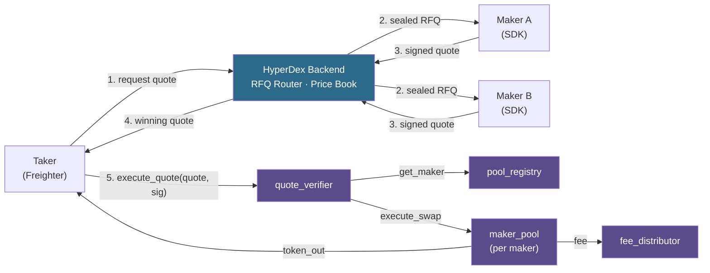
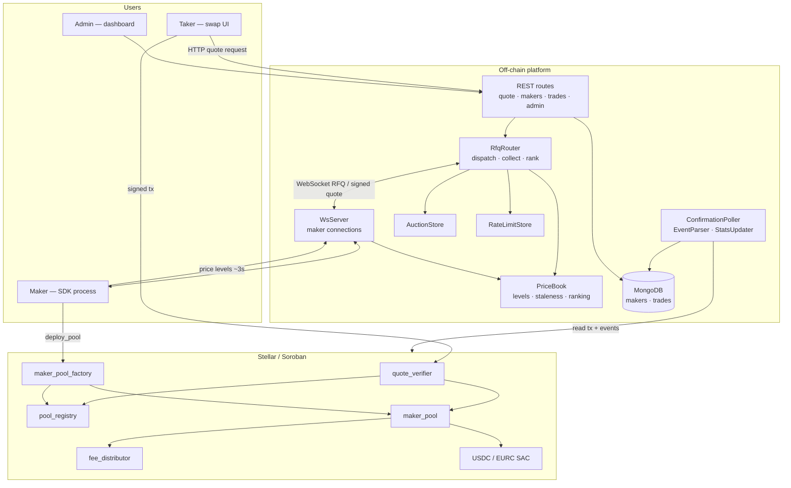
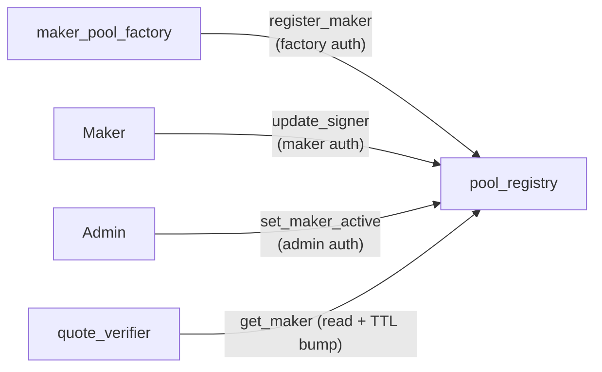
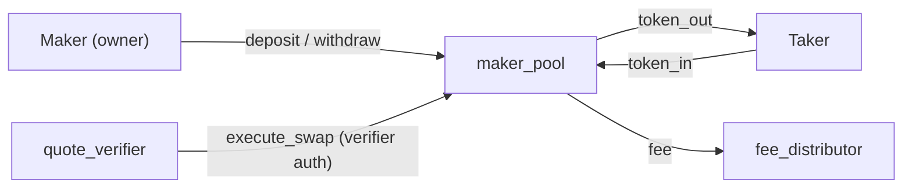
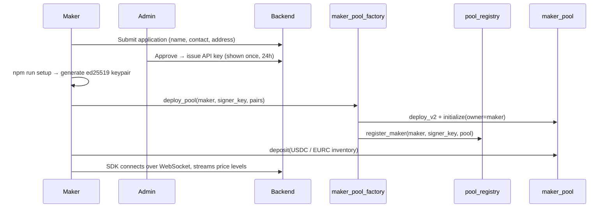
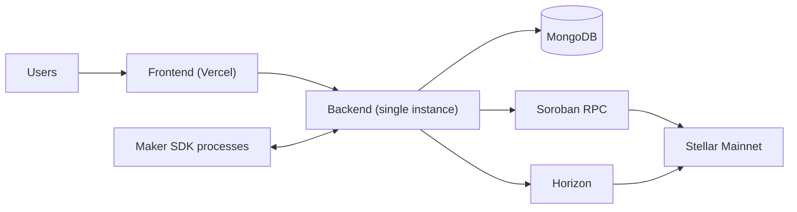
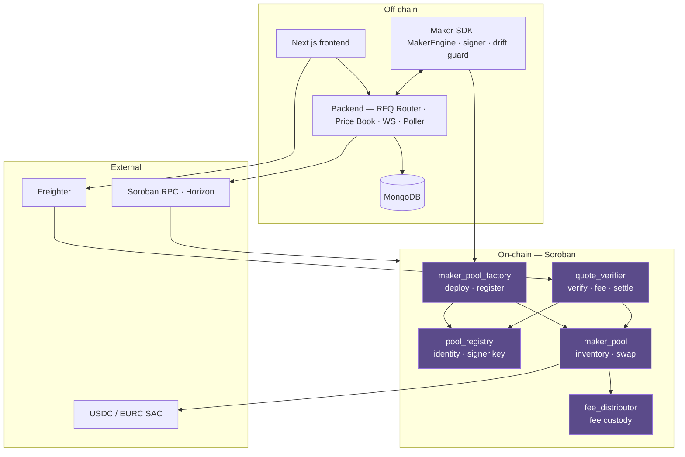

# HyperDex — Technical Architecture

> **Status.** Five Soroban contracts deployed to Stellar Mainnet on 9 July 2026. The protocol is
> deployed and initialised; at the time of writing it has not yet been exercised with live flow.
> This document describes the system as built, not as planned. Where something is not yet wired,
> it says so.

---

## 1. Introduction

### 1.1 High-Level Overview

HyperDex is a sealed-bid **request-for-quote (RFQ)** exchange on Stellar. Professional market makers
price and sign quotes off-chain for speed; signature verification, the token allowlist, replay
protection and the settlement of both legs happen on-chain in Soroban.

The problem it addresses is execution quality. An automated market maker prices from a bonding
curve, so trade size moves the price against the taker by construction, and the pending swap is
visible in flight. HyperDex instead runs a short auction among makers who each price the exact
requested size, and settles the winner's signed quote atomically. There is no price impact, and
nothing to front-run, because losing quotes are never revealed and the winning quote is not public
until it settles.

The system has six components:

| # | Component | Layer |
|---|-----------|-------|
| 1 | `quote_verifier` — signature verification and settlement entry point | On-chain |
| 2 | `pool_registry` — maker identity, signer key, pool address, active flag | On-chain |
| 3 | `maker_pool_factory` — deploys and registers one pool per maker | On-chain |
| 4 | `maker_pool` — per-maker inventory custody and swap execution | On-chain |
| 5 | `fee_distributor` — protocol fee accrual and treasury sweep | On-chain |
| 6 | Backend services + maker SDK — auction, price book, confirmation, signing | Off-chain |

Deployed mainnet addresses are listed in section 5.1.

### 1.2 Key Terms

| Term | Definition |
|------|------------|
| **RFQ** | Request for quote — a taker asks for a firm price on a specific size, rather than reading a public book |
| **Taker** | The party requesting and settling a quote; retains custody until the settlement transaction executes |
| **Maker** | A registered market maker who prices and signs quotes off-chain from their own inventory |
| **Sealed-bid** | Competing makers cannot see each other's quotes; losing bids are discarded, never published |
| **Quote** | The nine-field struct a maker signs (section 3.1); the unit of settlement |
| **Canonical message** | `SHA256(XDR(Quote))` — the exact bytes a maker signs and the contract verifies |
| **Signer key** | A maker's ed25519 public key, registered on-chain, distinct from their Stellar account key |
| **Maker pool** | A `maker_pool` contract instance owned by one maker, holding that maker's inventory |
| **Price levels** | A maker's advertised resting book, streamed to the backend every ~3s |
| **Ghost price** | The single rate the default engine auto-quotes, fee-adjusted, on every RFQ |
| **MakerEngine** | The pluggable pricing interface a maker implements to supply their own strategy |
| **Drift guard** | SDK protection that warns at >1% deviation from oracle mid and pauses quoting at >3% |
| **Protocol fee** | 10 bps, deducted from `amount_out` in contract and routed to `fee_distributor` |
| **Stroops** | Integer base unit; all on-chain amounts are `i128` stroops, never floats |
| **SAC** | Stellar Asset Contract — the Soroban interface to a classic Stellar asset such as USDC |
| **SEP-41** | The Soroban token interface implemented by SACs (`transfer`, `balance`, …) |
| **TTL** | Time-to-live; Soroban ledger entries expire unless extended (section 8) |
| **Instance storage** | Contract-global state, shares the contract's TTL |
| **Persistent storage** | Per-key state with independent TTL, restorable after expiry |
| **`require_auth`** | Soroban's host-enforced authorisation check on an `Address` |
| **Salt** | Per-quote randomness making each `quote_id`/signature pair unique |
| **Auction store** | Backend record of an in-flight RFQ and the quotes returned against it |

---

## 2. Architecture Overview

### 2.1 The Protocol at a Glance

Two things are deliberately split:

- **Pricing is off-chain.** Makers run their own strategy, stream price levels, and answer RFQs
  within a 750ms window. This is where speed matters and where nothing needs to be trustless.
- **Verification and settlement are on-chain.** The maker's signature, the quote's expiry, its
  single-use property, the token allowlist and the movement of both legs are enforced by Soroban.
  This is where trust matters and where speed is affordable — Stellar's ~5s finality and sub-cent
  fees make per-quote on-chain verification economical.

Custody never transfers to an operator. Maker inventory sits in that maker's own `maker_pool`
contract; taker funds are pulled inside the settlement transaction itself. There is no deposit step
for takers and no pre-funding.

### 2.2 High-Level Diagram



### 2.3 Detailed System Architecture



### 2.4 Architecture Constraints

| # | Constraint | Enforced by |
|---|-----------|-------------|
| 1 | Non-custodial — the operator never holds taker or maker funds | `maker_pool` owner check; taker funds pulled in-transaction |
| 2 | Atomic settlement — both legs move or neither does | Single Soroban transaction; any panic reverts everything |
| 3 | The operator cannot forge a quote | `ed25519_verify` against the registry-held signer key |
| 4 | A quote settles at most once | `UsedQuote(quote_id)` persistent marker |
| 5 | A quote cannot settle after expiry | `env.ledger().timestamp() >= quote.expiry` check |
| 6 | Only allowlisted tokens can trade | `token_in`/`token_out` must be the configured USDC or EURC |
| 7 | Per-maker isolation | One `maker_pool` contract instance per maker |
| 8 | Only the verifier can move pool inventory in a swap | `quote_verifier.require_auth()` in `execute_swap` |
| 9 | Only the factory can register a maker | `factory.require_auth()` in `register_maker` |
| 10 | Fees cannot exceed 100% | `MAX_FEE_BPS = 10_000` checked on init and update |

---

## 3. Smart Contracts

### 3.1 `quote_verifier`

The settlement entry point and the only contract a taker calls directly.

**The signed struct.** A maker signs this exact shape:

```rust
pub struct Quote {
    pub quote_id:   BytesN<32>,
    pub maker:      Address,
    pub taker:      Address,
    pub token_in:   Address,
    pub token_out:  Address,
    pub amount_in:  i128,
    pub amount_out: i128,
    pub expiry:     u64,
    pub salt:       BytesN<32>,
}
```

> **Serialisation note.** Soroban `#[contracttype]` structs encode as an XDR `ScMap` with fields in
> **alphabetical** key order — `amount_in, amount_out, expiry, maker, quote_id, salt, taker,
> token_in, token_out` — *not* declaration order. Any off-chain signer that reproduces declaration
> order will produce a hash the contract rejects with no useful diagnostic. See section 5.4.

**`execute_quote(quote, signature)` — the eleven steps, in order:**

| Step | Check | Failure |
|------|-------|---------|
| 1 | Both tokens are the configured USDC/EURC and differ from each other | `InvalidTokens` (4) |
| 2 | `ledger().timestamp() < quote.expiry` | `QuoteExpired` (5) |
| 3 | `quote_id` not already marked used | `QuoteAlreadyUsed` (6) |
| 4 | `quote.taker.require_auth()` | host auth failure |
| 5 | `pool_registry.get_maker(maker)` returns `active == true` | `InvalidSigner` (7) |
| 6 | Compute `msg_hash = sha256(quote.to_xdr(env))` | — |
| 7 | `ed25519_verify(signer_key, msg_hash, signature)` | `InvalidSignature` (8) |
| 8 | Mark `UsedQuote(quote_id)`, extend its TTL | — |
| 9 | `fee = amount_out * fee_bps / 10_000`; `taker_gets = amount_out - fee` | — |
| 10 | Call `maker_pool.execute_swap(...)` on the maker's own pool | reverts whole tx |
| 11 | Emit `quote_executed` | — |

Every check precedes any token movement, and steps 1–7 are pure validation — nothing is written
before the signature is proven.

**Administrative surface:** `initialize(admin, registry, fee_distributor, usdc, eurc, fee_bps)`,
`set_fee_bps(new_fee_bps)` (admin-authorised, capped at `MAX_FEE_BPS`), `get_protocol_fee()`.

> **Current limitation.** The allowlist is two hard-coded addresses held in `Config`. Listing a new
> asset requires redeploying or reinitialising the verifier. Replacing this with a governance-gated
> registry is the single largest planned contract change.

### 3.2 `pool_registry`

The single source of truth for maker identity. `quote_verifier` reads it on every settlement.



| Function | Auth | Purpose |
|----------|------|---------|
| `initialize(admin, factory)` | admin | Binds the admin and the sole authorised registrar |
| `register_maker(maker, signer_key, pool_address, pairs)` | **factory** | Creates `MakerInfo`; rejects duplicates |
| `update_signer(maker, new_signer_key)` | **maker** | Key rotation without redeployment |
| `set_maker_active(maker, active)` | **admin** | Suspend or restore a maker |
| `get_maker(maker) -> MakerInfo` | none | Canonical single read; **bumps TTL as a side effect** |
| `get_pool_address` / `get_signer_key` | none | Pure reads, no TTL effect — off-chain callers |
| `is_active` / `is_valid_signer` | none | Boolean convenience reads |

`get_maker` returns the whole `MakerInfo` in one cross-contract call rather than three separate
reads, and bumping its TTL on read means an actively trading maker's entry stays alive as a natural
side effect of trading.

### 3.3 `maker_pool_factory`

`deploy_pool(maker, signer_key, supported_pairs) -> Address` does four things atomically, under the
**maker's own** authorisation:

1. Rejects a second pool for the same maker (`PoolAlreadyDeployed`).
2. Deploys a `maker_pool` instance via `deploy_v2`, with salt `sha256(XDR(maker_address))`.
3. Initialises that pool with the maker as owner and the verifier as the sole swap caller.
4. Calls `pool_registry.register_maker(...)`.

> **Why a deterministic salt.** The salt is derived from the maker address alone — deliberately not
> from ledger sequence. A sequence-derived salt would produce a different contract address at
> simulation time than at execution time, causing a footprint mismatch and a trap.

The signer key is **not** stored in the pool. It lives only in `pool_registry`, so there is exactly
one place settlement reads it from.

### 3.4 `maker_pool`

One instance per maker, holding that maker's inventory.



| Function | Auth | Notes |
|----------|------|-------|
| `initialize(owner, quote_verifier, usdc, eurc)` | factory (in-tx) | One-shot |
| `deposit(maker, token, amount)` | maker == owner | Direct `transfer`; no separate approve needed |
| `withdraw(maker, token, amount)` | maker == owner | Checked against internal balance |
| `execute_swap(...)` | **`quote_verifier` only** | The settlement primitive |
| `get_balance(token)` / `get_owner()` | none | Reads |

`execute_swap` verifies inventory covers `amount_out + fee_amount` *before* moving anything, then
pulls `token_in` from the taker, sends `token_out` to the taker, forwards the fee to
`fee_distributor`, and updates internal balances. Because it runs inside the taker's single
transaction, a failure at any point reverts the entire settlement.

### 3.5 `fee_distributor`

Deliberately minimal. Fees arrive as a plain token transfer from `maker_pool` during settlement;
this contract simply holds them.

| Function | Auth | Notes |
|----------|------|-------|
| `initialize(admin, treasury)` | admin | — |
| `withdraw_fees(token)` | admin | Sweeps the contract's **actual token balance** to treasury |
| `get_fees(token)` | none | Reads the real balance |

There is no internal fee ledger to drift out of sync with real balances — the contract's token
balance *is* the accounting.

---

## 4. Protocol Flows

### 4.1 Maker Onboarding



The maker signs the `deploy_pool` transaction themselves, so pool creation and registration are
authorised by the maker rather than the operator. The admin's power is limited to issuing the API
key and toggling `active`.

### 4.2 Quote Request to Settlement

```mermaid
sequenceDiagram
    participant T as Taker
    participant API as REST /quote
    participant RFQ as RfqRouter
    participant PB as PriceBook
    participant M as Makers (N)
    participant QV as quote_verifier
    participant R as pool_registry
    participant P as maker_pool

    T->>API: tokenIn, tokenOut, amountIn
    API->>RFQ: requestQuote
    RFQ->>RFQ: validate tokens, amount
    RFQ->>PB: getBestMakers(pair, size)
    PB-->>RFQ: ranked makers (stale levels excluded)
    RFQ->>M: sealed RFQ to top N, in parallel
    Note over RFQ,M: 750ms deadline · non-responders excluded
    M-->>RFQ: signed quotes (ed25519 over SHA256(XDR(Quote)))
    RFQ->>RFQ: rank; losers discarded unopened
    RFQ-->>T: winning quote + signature
    T->>QV: execute_quote(quote, signature)
    QV->>R: get_maker → signer_key, pool, active
    QV->>QV: expiry · replay · taker auth · ed25519_verify
    QV->>P: execute_swap(...)
    P-->>T: token_out (net of 10 bps fee)
```

Quotes that lose the auction are discarded and never returned by any API surface — that property is
what makes the auction sealed rather than merely private.

### 4.3 Inventory Deposit and Withdrawal

A maker deposits by calling `deposit` on their own pool, signing with their Stellar wallet. Because
the maker is the `from` address and has authorised the transaction, no separate SAC approval step is
required. Withdrawal is symmetric and checked against the pool's internal balance. Inventory is
never pooled across makers, so one maker's drawdown cannot touch another's.

### 4.4 Fee Accrual and Sweep

Each settlement deducts `amount_out × 10 bps` before the taker leg is paid, and `maker_pool`
transfers it to `fee_distributor` in the same transaction. Fees accumulate as a real token balance.
The admin sweeps to treasury with `withdraw_fees(token)`.

### 4.5 Signer Rotation and Suspension

A maker rotates their signing key with `update_signer`, authorised by the maker's own address —
no admin involvement and no redeployment. The admin can independently set `active = false`, after
which `quote_verifier` rejects that maker's quotes at step 5 while leaving their inventory
withdrawable.

---

## 5. Technology Stack

### 5.1 Smart Contracts (Soroban / Rust)

| Contract | Mainnet address | Role |
|----------|-----------------|------|
| `pool_registry` | `CDONQCEJFQHOUIFWB4X4K2MVSFXH6HLEYPWRBPTAUR4WZNP2FD4YSQWW` | Maker identity |
| `quote_verifier` | `CDMOUCUKCZRMSYQE5TQ7QVGVUFJYFSP7XLLBHL3ZE2EQLZGZUFC4PHXK` | Verify + settle |
| `maker_pool_factory` | `CBDD5WBPCX6GSF4XIP6CAKAM3TCU6R73CW7QNYUTXXT3OAGEPFFACOI4` | Deploy pools |
| `fee_distributor` | `CAAWWYIUWKV2Z4OGAVBXNVRGRCN3QY3FF4M2BLV72V2MBNEVFLMSAU2R` | Fee custody |
| `maker_pool` | deployed per maker | Inventory + swap |
| USDC SAC | `CCW67TSZV3SSS2HXMBQ5JFGCKJNXKZM7UQUWUZPUTHXSTZLEO7SJMI75` | `USDC-GA5ZSEJY…` |
| EURC SAC | `CDTKPWPLOURQA2SGTKTUQOWRCBZEORB4BWBOMJ3D3ZTQQSGE5F6JBQLV` | `EURC-GDHU6WRG…` |

`no_std` Rust on the Soroban SDK. Build → optimize → deploy → initialize via the Stellar CLI;
`scripts/deploy-v2.sh` carries the sequence.

### 5.2 Backend

| Concern | Implementation |
|---------|----------------|
| Runtime | Node.js / TypeScript, Express-style routes |
| Auction | `rfq/RfqRouter.ts`, `rfq/AuctionStore.ts` |
| Ranking | `pricebook/PriceBook.ts` — level staleness, per-maker ranking |
| Maker transport | `websocket/WsServer.ts`, `MakerConnection.ts`, `TradePushService.ts` |
| Signature check | `rfq/verifyQuoteSignature.ts` (pre-flight, before the taker pays gas) |
| Abuse control | `rfq/RateLimitStore.ts` |
| Confirmation | `poller/ConfirmationPoller.ts`, `EventParser.ts`, `StellarTxFetcher.ts`, `StatsUpdater.ts` |
| Persistence | MongoDB — `Maker`, `Trade` |
| Routes | `quote`, `makers`, `trades`, `admin`, `adminPending`, `health` |

**Tunable parameters** (`backend/src/config.ts`):

| Key | Default | Meaning |
|-----|---------|---------|
| `RFQ_TIMEOUT_MS` | `750` | Maker response window |
| `RFQ_MAX_MAKERS` | `3` | Makers dispatched per auction |
| `PRICE_LEVEL_STALE_MS` | `5000` | Levels older than this are excluded from ranking |
| `RATE_LIMIT_WINDOW_MS` | `1000` | Rate-limit window |
| `RATE_LIMIT_MAX_REQUESTS` | `10` | Requests per window |
| `PROTOCOL_FEE_BPS` | `10` | Must match the on-chain `fee_bps` |

### 5.3 Frontend

Next.js 14 App Router with Freighter for signing. Surfaces: swap terminal, maker dashboard
(application, on-chain registration, inventory, price levels, SDK status), and admin
(pending approvals, API-key issuance, maker roster).

> **Current limitation.** Freighter only. Migration to Stellar Wallets Kit is planned; wallets
> lacking `signAuthEntry` will need a documented fallback for the taker authorisation in step 4.

### 5.4 Maker SDK

| Module | Role |
|--------|------|
| `serializer.ts` | Builds the canonical `ScMap` in **alphabetical** field order and hashes it |
| `signer.ts` | ed25519 signature over `SHA256(XDR(Quote))` |
| `ws-client.ts` | Backend connection, RFQ subscription, reconnect |
| `engines/default-engine.ts` | Ghost-price reference engine |
| `drift-guard.ts` | Warns >1%, pauses quoting >3% versus oracle mid |
| `inventory-checker.ts` | Caps quotes at ~80% of pool balance |
| `price-levels.ts` | Streams `getLevels()` output every ~3s |
| `rate-limiter.ts` | Client-side request shaping |

Pricing is pluggable through the `MakerEngine` interface:

| Method | Called | Returns |
|--------|--------|---------|
| `getLevels()` | every ~3s | `{ sellLevels, buyLevels }`; empty arrays go offline gracefully |
| `getQuote(ctx)` | per RFQ | `amountOut` in stroops as a string, or `null` to skip without penalty |
| `onTradeConfirmed(trade)` | on fill *(optional)* | Refresh inventory, hedge, log |

A maker supplies their own engine with `--engine=./my-engine.ts` and never shares their strategy.
If the file is missing or malformed the SDK logs and falls back to the built-in engine rather than
crashing.

### 5.5 Infrastructure



> **Current limitation.** Off-chain services run on a single instance with no health-gated failover,
> no public status page and no alerting on stale price levels, settlement backlog or maker
> disconnection. This is the largest operational gap in the system.

---

## 6. Integrations

| Integration | Purpose | Status |
|-------------|---------|--------|
| Freighter | Taker and maker transaction signing | Live |
| Stellar Wallets Kit | Multi-wallet (Lobstr, xBull, Albedo, Hana, Ledger) | Planned |
| Soroban RPC | Simulation, submission, ledger entry reads | Live |
| Horizon | Transaction confirmation polling | Live |
| USDC / EURC SAC (SEP-41) | Token transfers in settlement | Live |
| MongoDB | Maker and trade persistence | Live |
| Soroswap `AdapterTrait` | Aggregator routability | Planned |
| Axelar GMP · Circle CCTP | Cross-chain intent and native USDC transport | Planned |

---

## 7. Typed Rust Function Signatures

### 7.1 `quote_verifier`

```rust
pub fn initialize(env: Env, admin: Address, registry: Address, fee_distributor: Address,
                  usdc: Address, eurc: Address, fee_bps: u32);
pub fn execute_quote(env: Env, quote: Quote, signature: BytesN<64>);
pub fn set_fee_bps(env: Env, new_fee_bps: u32);
pub fn get_protocol_fee(env: Env) -> u32;
```

### 7.2 `pool_registry`

```rust
pub fn initialize(env: Env, admin: Address, factory: Address);
pub fn register_maker(env: Env, maker: Address, signer_key: BytesN<32>,
                      pool_address: Address, pairs: Vec<(Address, Address)>);
pub fn update_signer(env: Env, maker: Address, new_signer_key: BytesN<32>);
pub fn set_maker_active(env: Env, maker: Address, active: bool);
pub fn get_maker(env: Env, maker: Address) -> MakerInfo;
pub fn get_pool_address(env: Env, maker: Address) -> Address;
pub fn get_signer_key(env: Env, maker: Address) -> BytesN<32>;
pub fn is_active(env: Env, maker: Address) -> bool;
pub fn is_valid_signer(env: Env, maker: Address, signer_key: BytesN<32>) -> bool;
```

### 7.3 `maker_pool_factory`

```rust
pub fn initialize(env: Env, admin: Address, pool_registry: Address, quote_verifier: Address,
                  fee_distributor: Address, usdc: Address, eurc: Address,
                  pool_wasm_hash: BytesN<32>);
pub fn deploy_pool(env: Env, maker: Address, signer_key: BytesN<32>,
                   supported_pairs: Vec<(Address, Address)>) -> Address;
pub fn get_pool(env: Env, maker: Address) -> Option<Address>;
```

### 7.4 `maker_pool`

```rust
pub fn initialize(env: Env, owner: Address, quote_verifier: Address,
                  usdc: Address, eurc: Address);
pub fn deposit(env: Env, maker: Address, token: Address, amount: i128);
pub fn withdraw(env: Env, maker: Address, token: Address, amount: i128);
pub fn execute_swap(env: Env, token_in: Address, token_out: Address,
                    amount_in: i128, amount_out: i128, taker: Address,
                    fee_amount: i128, fee_distributor: Address);
pub fn get_balance(env: Env, token: Address) -> i128;
pub fn get_owner(env: Env) -> Address;
```

### 7.5 `fee_distributor`

```rust
pub fn initialize(env: Env, admin: Address, treasury: Address);
pub fn withdraw_fees(env: Env, token: Address);
pub fn get_fees(env: Env, token: Address) -> i128;
```

---

## 8. Soroban Storage Layout

### 8.1 `quote_verifier`

| Type | Key | Data | Rationale |
|------|-----|------|-----------|
| Instance | `Config` | admin, registry, fee_distributor, usdc, eurc, fee_bps | Read on every settlement |
| Instance | `Initialized` | `bool` | One-shot guard |
| Persistent | `UsedQuote(BytesN<32>)` | `true` | Per-quote replay marker; independent TTL |

### 8.2 `pool_registry`

| Type | Key | Data | Rationale |
|------|-----|------|-----------|
| Instance | `Admin`, `Factory`, `Initialized` | addresses, flag | Global config |
| Persistent | `Maker(Address)` | `MakerInfo` | Per-maker; TTL bumped on `get_maker` |

### 8.3 `maker_pool_factory`

| Type | Key | Data | Rationale |
|------|-----|------|-----------|
| Instance | `Admin`, `PoolRegistry`, `QuoteVerifier`, `FeeDistributor`, `Usdc`, `Eurc`, `PoolWasm`, `Initialized` | config | Read on each deploy |
| Persistent | `MakerPool(Address)` | pool address | One-pool-per-maker guard |

### 8.4 `maker_pool`

| Type | Key | Data | Rationale |
|------|-----|------|-----------|
| Persistent | `Owner`, `QuoteVerifier`, `Usdc`, `Eurc`, `Initialized` | config | Persistent (not instance) so pool config outlives instance TTL |
| Persistent | `Balance(Address)` | `i128` | Per-token inventory |

### 8.5 `fee_distributor`

| Type | Key | Data | Rationale |
|------|-----|------|-----------|
| Instance | `Admin`, `Treasury`, `Initialized` | config | No per-token ledger by design |

### 8.6 TTL and Keepers

All five contracts use `LEDGER_THRESHOLD = 1_000_000` and `LEDGER_BUMP = 1_500_000`. Entries are
extended opportunistically on write, and `pool_registry::get_maker` extends on read — so an active
maker's registration is kept alive by trading itself. Entries for a dormant maker will eventually
expire and require restoration before that maker can trade again. A dedicated TTL keeper is not yet
deployed; this is a known operational gap.

---

## 9. Quote Pricing and Validation

### 9.1 Where Price Comes From

Price originates entirely off-chain, from the maker's `MakerEngine`. The protocol takes no view on
what a fair price is — it enforces only that the price the taker sees is the price the maker signed,
and that it settles once, before expiry, in the allowlisted pair.

### 9.2 Ranking

`PriceBook.getBestMakers(tokenIn, tokenOut, amountIn)` ranks connected makers, excluding those whose
streamed levels are older than `PRICE_LEVEL_STALE_MS` (5s). The top `RFQ_MAX_MAKERS` receive the RFQ
in parallel; `Promise.allSettled` collects within `RFQ_TIMEOUT_MS` (750ms). Non-responders are
excluded without stalling the auction, and refusals and timeouts accrue a penalty that discounts
future ranking.

> **Current limitation.** With a single connected maker, ranking has never been contested. The
> penalty score lives in process memory and resets on restart. Persisting it and publishing
> per-maker metrics is planned.

### 9.3 Protections

| Protection | Mechanism | Layer |
|-----------|-----------|-------|
| Stale pricing | Levels >5s excluded from ranking | Off-chain |
| Quoting beyond inventory | SDK caps at ~80% of pool balance | Off-chain |
| Oracle divergence | Drift guard warns >1%, pauses >3% | Off-chain |
| Quoting away from published levels | Returned quote validated against maker's own levels | Off-chain |
| Request flooding | `RateLimitStore`, 10 req/s | Off-chain |
| Stale settlement | `expiry` vs ledger timestamp | **On-chain** |
| Double-spend of a quote | `UsedQuote(quote_id)` | **On-chain** |
| Forged quote | `ed25519_verify` vs registry signer key | **On-chain** |
| Unlisted asset | Token allowlist | **On-chain** |
| Insufficient maker inventory | Balance check before any transfer | **On-chain** |

### 9.4 Settlement Math

```
fee_amount = amount_out × fee_bps / 10_000     // fee_bps = 10 (0.10%)
taker_gets = amount_out − fee_amount
```

All quantities are `i128` stroops. Integer division truncates in the protocol's favour by at most
one stroop. `MAX_FEE_BPS = 10_000` prevents a misconfigured fee from making `taker_gets` negative.

---

## 10. Soroban Events

| Contract | Topic | Payload |
|----------|-------|---------|
| `quote_verifier` | `quote_executed` | `(quote_id, maker, taker)` |
| `pool_registry` | `maker_registered` | `maker` |
| `maker_pool_factory` | `pool_deployed` | `(maker, pool_address)` |
| `maker_pool` | `pool_initialized` | `owner` |
| `maker_pool` | `deposit` | `(maker, token, amount)` |
| `maker_pool` | `withdraw` | `(maker, token, amount)` |
| `maker_pool` | `swap_executed` | `(token_in, token_out, amount_in, amount_out)` |
| `fee_distributor` | `fees_withdrawn` | `(token, amount)` |

`poller/EventParser.ts` consumes these to reconcile off-chain trade records against chain state.

---

## 11. Off-Chain Services

| Service | Trigger | Action |
|---------|---------|--------|
| RFQ Router | Taker quote request | Dispatch, collect within 750ms, rank, return winner |
| Price Book | Maker level stream (~3s) | Maintain rankable view, expire stale levels |
| WebSocket Server | Maker connect/disconnect | Authenticate by API key, route RFQs, push confirmations |
| Confirmation Poller | Submitted settlement tx | Poll Horizon, parse events, update trade records |
| Stats Updater | Confirmed trade | Update per-maker counters |

All are Node.js processes sharing the backend MongoDB. They are stateless with respect to funds —
no service holds a key that can move value.

---

## 12. STRIDE Threat Model

| Threat | Scenario | Mitigation |
|--------|----------|------------|
| **Spoofing** | Operator or attacker fabricates a quote the maker never priced | `ed25519_verify` against the signer key in `pool_registry`; the operator holds no signing key |
| **Tampering** | Amounts altered between quote and settlement | Every field is inside the signed `SHA256(XDR(Quote))`; any change invalidates the signature |
| **Repudiation** | Maker denies having quoted a price | The signature is binding and the settlement transaction is on-chain with `quote_executed` |
| **Information disclosure** | Losing bids leak, exposing maker strategy | Losing quotes discarded unopened, never logged or returned by any API surface |
| **Denial of service** | Request flooding, or a maker stalling auctions | 750ms deadline excludes non-responders; per-maker/taker rate limiting; penalty scoring |
| **Elevation of privilege** | Operator moves maker inventory or a maker drains another's pool | `execute_swap` requires `quote_verifier` auth; `deposit`/`withdraw` require `owner`; one pool per maker |

### 12.1 Stellar Protocol-Level Protections

| Property | Provided by |
|----------|-------------|
| No mempool front-running of the quote | Quote is invisible off-chain until the settlement transaction |
| Atomicity | Soroban transaction semantics — any panic reverts all state |
| Replay resistance across transactions | Stellar sequence numbers plus in-contract `UsedQuote` |
| Fund isolation | Separate contract instance per maker |
| Auth soundness | Host-enforced `require_auth` / `require_auth_for_args` |

### 12.2 Known Residual Risks

| Risk | Status |
|------|--------|
| Admin authority is a single key, not multisig | Open |
| Rate limiting enforced off-chain only | Open |
| No maker bond — non-fulfilment costs ranking, not capital | Open |
| Contracts not yet independently audited | Open |
| Contract WASM not yet source-verified on stellar.expert | Open |
| No TTL keeper for dormant entries | Open |

---

## 13. Component Summary



| Layer | Holds funds | Can move funds | Trust required |
|-------|-------------|----------------|----------------|
| Frontend | No | No | None |
| Backend | No | No | Availability and fair ranking only |
| Maker SDK | No | Signs quotes only | Maker trusts their own process |
| `maker_pool` | **Yes** | Only via verified quote or owner withdrawal | Contract code |
| `quote_verifier` | No | Orchestrates settlement | Contract code |
| `fee_distributor` | **Yes** (fees) | Admin sweep to treasury | Admin key |

The backend is deliberately the least trusted component that does the most work: it can refuse
service or rank badly, but it cannot forge a quote, move inventory, or settle anything a maker did
not sign.
